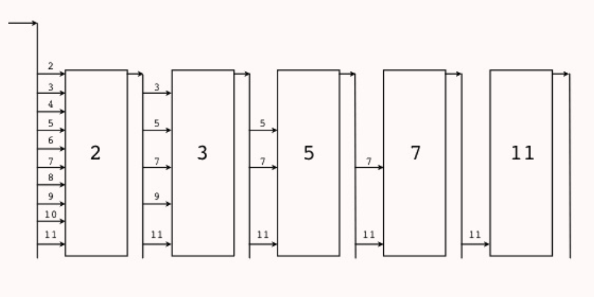

# 第1章 语言基础
## 1.2 Hello, World的革命
* [hello.go](./code/hello/hello.go)
* [http-hello.go](./code/http-hello/http-hello.go)

## 1.3 数组、字符串和切片
* 赋值方式<br>
除了闭包函数以引用方式访问外，其他赋值或函数传参都是传值。

### 1.3.1 数组
* 值语义：赋值或函数传参时是整体复制（包括底层内存）
* 不同长度代表不同类型，因此不能互相赋值
* 定义：[array-defination.go](./code/array/defination.go)
* 指针与赋值：[array-pointer.go](./code/array/pointer.go)
* 二维数组：[array-two-dimension.go](./code/array/two-dimension.go)

### 1.3.2 字符串
* 只读
* 赋值时只复制了地址和长度
* 底层头部结构`reflect.StringHeader`: [string-len.go](./code/string/len.go)
```go
type StringHeader struct {
    Data uintptr
    Len int
}
```
* 字符串以UTF8编码：[string-utf8.go](./code/string/utf8.go)
* `rune`：[string-rune.go](./code/string/rune.go)
    - `rune` means the same as "code point" which refers to the item represented by a single value. For example, the code point U+2318, with hexadecimal value 2318, represents the symbol ⌘. So,
    > `⌘` is `rune` with integer value 0x2318.
* 单引号、双引号、反引号：[string-single-double-back-quote.go](./code/string/single-double-back-quote.go)
    - 单引号表示`rune`类型
    - 双引号表示`string`类型
    - 反引号用来创建原生的字符串字面量，不支持任何转义序列
* `string`、`[]byte`和`[]rune`之间的转换：[string-bytes-transition](./code/string/string-bytes-runes-transition.go)

### 1.3.3 切片
* 头部含有底层数据指针和容量信息
* 赋值或传参时只赋值头部信息（注意这也时按值（头部的值）传递）
* 长度不是类型的组成部分，是简化版的动态数组
* 底层头部结构`reflect.SliceHeader`:
```go
type SliceHeader struct {
    Data uintptr
    Len int
    Cap int
}
```
* 定义：[slice-defination](./code/slice/defination.go)
* 追加切片元素：[slice-append](./code/slice/append.go)

## 1.4 函数、方法和接口
* 函数
    - 具名函数<br>
    是匿名函数的一种特例
    - 匿名函数<br>
    匿名如果引用了外部作用域中的变量就变成了闭包函数
* 方法
    - 绑定到一个具体类型的特殊函数
    - 编译时静态绑定
* 接口
    - 方法的集合
    - 运行时动态绑定
    - 通过隐式接口机制实现了鸭子面向对象模型
* Go程序初始化入口：`main.main`函数
    1. 导入其他包，执行每个包的`init`函数
    2. `main`包的所有包级常量、变量被创建和初始化，并执行`main`包的`init`函数

### 1.4.1 函数
* 函数是第一类的对象
* 具名函数
```go
func Add(a, b int) int {
    return a+b
}
```
* 匿名函数
```go
var Add = func(a, b int) int {
    return a+b
}
```
* 多返回函数
```go
func Swap(a, b int) (int, int) {
    return b, a
}
```
* 可变参数；[func-variable-parameter](./code/func/variable-parameter.go)
    - `func foo(parm ...int)`打包，将多个传入`foo`的`int`类型打包成一个`[]int`
    - `foo(parm...)`拆包，将`parm`拆成多个`int`类型的数据，传给`foo`
* `defer`关键字
    - 延时被修饰的函数到当前函数结束的时候执行
    - `defer`多个函数的按照先进后出的顺序执行
    - `defer`一个匿名函数<br>
    需要注意闭包捕获是按**引用**方式传递的，如果多个`defer`匿名函数捕获外部变量，会是同一个引用，参见：[func-defer](./code/func/defer.go)
* Go语言的栈
    - Go编译器会处理栈和堆的问题，不需要程序员考虑，参见：[func-stack-heap](./code/func/stack-heap.go)
    - 不要假设变量在内存中的位置是固定不变的，因为Go采用动态栈实现函数栈大小的调整。每个`goroutine`刚启动时只会分配很小的栈，当有需求增大栈空间时，新内存空间被开辟，为了保持栈的连续，之前的数据会移动到新开辟的内存空间，这会导致之前中全部变量的地址发生变化。

### 1.4.2 方法
* Go方法不支持重载，每个方法的名字必须时唯一的
* 将方法还原为普通类型的函数
```go
// func (f *File) Close() error {...}
// to
// func CloseFile(f *File) error
var CloseFile = (*File).Close
```
* Go语言的继承
    - 通过结构体内置匿名成员来继承匿名成员的内部成员和对应方法：[method-inherit](./code/method/inherit.go)
    - `childType.parentVar`会在编译时被展开为`childType.parentType.parentVar`
    - `C++`子类方法是在运行时动态绑定到对象的，因此基类实现的某些方法看到的`this`可能不是基类类型对应的对象，这个特性会导致基类方法运行的不确定性。Go语言通过嵌入匿名的成员来“继承”基类的方法，`this`就是实现该方法的类型的对象。但是这样的方法并不能实现`C++`中虚函数的多态特性。如果需要虚函数的多态特性，我们需要借助Go语言接口来实现。

### 1.4.3 接口
* 接口类型实现了对鸭子类型的支持
* 利用`fmt.Printf`的接口参数，实现大写输出：<br>
    - [interface-upper-writer](./code/interface/upper-writer.go)
    - [interface-upper-string](./code/interface/upper-string.go)
* 接口的显式转换与隐式转换：[interface-conversion](./code/interface/conversion.go)
    - 非接口类型（如`int`型）不支持隐式转换，必须显示转换，如：
    > `var numInt64 = (int64)(numInt)`
    - 接口和对象，接口和接口之间的转换支持隐式转换
* 内置接口
```go
type error interface {
    //只要实现了Error()函数，返回值为String的都实现了error接口
    Error() String
}
```
* 接口“继承”接口
```go
type runtime.Error interface {
    error
    // 既需要实现上面的Error()函数，也需要实现RuntimeError()函数，才实现了runtime.Error接口
    RuntimeError()
}
```
* 接口的类型和内容：[interface-value-type](./code/interface/value-type.go)
    - 类型：实现此接口的`struct`的类型(`Foo`或者是`Foo`的指针)。
    - 内容：实现此接口的`struct`的内容。

## 1.5 面向并发的内存模型
* 与Erlang不同，Go语言的Goroutine之间是共享内存的
### 1.5.1 Goroutine和系统线程
* goroutine和系统线程不是等价的
### 1.5.2 原子操作
* `sync.Mutex`：[lock-mutex](./code/lock/mutex.go)
* `atomic`: [lock-atomic](./code/lock/atomic.go)
* `sync.Once`：[lock-singleton](./code/lock/singleton.go)
### 1.5.3 顺序一致性内存模型
* 两个Goroutine之间，一个Goroutine不能知道另一个Goroutine的内部执行顺序，甚至一直不能看到对共享资源的改动（可能始终在寄存器中），直到另一个Goroutine结束。
### 1.5.6 基于Channel的通信
* 对Channel的发送和接收通常发生在不同的Goroutine上，在同一个Goroutine上执行2个操作很容易导致死锁。
* 无缓冲的Channel上的发送操作总在对应的接收操作完成前发生：[unbuffered-channel](./code/channel/unbuffered-channel.go)
* 对于带缓冲的Channel，第K个接收完成操作发生在第K+C个发送完成之前，其中C是Channel的缓存大小。对于从无缓冲Channel进行的接收，发生在对该Channel进行的发送**完成**之前。对于从无缓冲Channel进行的接收**完成**，发生在对该Channel进行的发送完成之后。
* `select{}`是一个空的管道选择语句，会导致线程阻塞。

## 1.6 常见的并发模式
> Do not comunicate by sharing memory; instead, shared memory by communicating.<br>
不要通过共享内存来通信，而应通过通信来共享内存。

* 并发与并行
    - 并发是程序设计层面，并发的程序运行在单核的计算机上就是顺序执行的。
    - 并行关注的是程序的运行层面，如GPU中对图像处理会有大量的并行计算。
### 1.6.1 并发版本的Hello World
* 并发编程核心：同步通信
* 同步方式:
    - `sync.Mutex`：不是递归锁
    - `chan`(推荐)：等待方接收Channel，执行方发送Channel，以防止带缓冲的Channel影响同步，参见：[sync-tasks.go](./code/channel/sync-tasks.go)
    - `sync.WaitGroup`: [sync-tasks2.go](./code/channel/sync-tasks2.go)
### 1.6.2 生产者消费者模型
* [Producer-Consumer](./code/pattern/producer-consumer.go)
### 1.6.3 发布订阅模型
* [Publish-Subscribe](./code/pattern/publish-subscribe.go)
### 1.6.6 素数筛
* [Prime-Filter](./code/pattern/prime-filter.go)
<br>
    - 素数判断标准：一个数不能被小于自己的所有素数整除
    - 按上图的思路，自然数先过第一个素数2的筛选，选出不可以被2整除的所有数。最小的那个数3就是下一个素数。再给下一个素数3，选出不可以被3整除的所有数。最小的数5就是下一个素数。以此类推。
    - 利用`chan`可以将各个步骤串起来。例如，被2筛选出来的数，最小的是下一个素数，再将剩下的数传给3。
### 1.6.7 并发的安全退出
* `select`处理多个管道的发送或接收操作
* 当有多个管道均可操作时，`select`会随机选择一个管道（注意，不是从上往下执行）
* 当没有管道可操作时，如果有`default`分支，会执行`default`分支，否则会一直阻塞
* 用`select`控制Goroutine退出：[select-quit-goroutine](./code/control-goroutine/select-channel-quit.go)
    - 通过`close`一个管道通知所有Goroutine停止
    - 通过`sync.WaitGroup`保证各Goroutine清理工作完成
* 用`context`控制单个请求的多个Goroutine：[context-quit-goroutine](./code/control-goroutine/select-context-quit.go)

## 1.7 错误和异常
### 1.7.1 错误处理策略
* `defer`在出错时关闭文件：[error-defer.go](./code/error/defer.go)
* 用`recover`捕获所有处理流程中可能产生的异常，然后将异常转为普通的错误返回。
### 1.7.4 剖析异常
* 函数用`panic`抛出异常 -> 函数停止执行后续的普通语句 -> 执行之前注册的`defer`语句 -> 返回到调用者
* 函数用`panic`抛出异常 -> 函数停止执行后续的普通语句 -> 执行之前注册的`defer`语句，并在`defer`中用`recover`捕获异常
* 在一个函数中用`panic`抛出异常，不能在此函数的非`defer`语句中调用`recover`捕获
* 如果想在抛出`panic`的函数的`defer`语句中捕获异常成功，必须和有异常的栈帧只隔一个栈帧，例如
```go
func foo() {
    // 无法捕获异样
    defer recover()
    panic(1)
}
```
```go
func foo() {
    defer func() {
        // 可以捕获异常
        if r := recover(); r != nil {...}
    }（）
    panic(1)
}
```
```go
func myRecover() interface{} {
    return recover()
}
func foo() {
    // 可以捕获异常
    defer myRecover()
    panic(1)
}
```
```go
func foo() {
    defer func() {
        // 无法捕获异常
        if r := myRecover(); r != nil {...}
    }()
    panic(1)
}
```

# 第2章 CGO编程
## 2.1 快速入门
### Hello World
* 使用Go的`imoport "C"`库：[cgo-hello](./code/cgo/hello/hello.go)
* 在Go文件中调用C的库函数：[cgo-c-lib-call](./code/cgo/hello/c-lib-call.go)
* 在Go文件中定义C函数并调用：[cgo-c-call](./code/cgo/hello/c-call.go)
    - 在注释的C代码和`import "C"`之间不能有空行
* 在Go文件中声明C函数，在C文件中定义函数：[cgo-extern-c-call](./code/cgo/hello/extern-c-call/hello.go)
    - C文件和Go文件需要在一个文件夹下
    - 运行`go run .`而不是`go run xx.go`
* 在Go文件中声明C++函数，在Cpp文件中定义函数：[cgo-extern-cpp-call](./code/cgo/hello/extern-cpp-call/hello.go)
    - 需要通过`extern "C"`语句指示该函数的链接符号遵循C语言的规则
* 在Go文件中使用C++类：[cgo-cpp-class-call](./code/cgo/hello/cpp-class-call/foo.go)
    - C++类的源文件：`Foo.h`和`Foo.cpp`
    - 用C包了C++类：`cFoo.h`和`cFoo.cpp`
    - 上面的四个文件会生成一个静态连接库`libfoo.a`供`foo.go`链接调用
    - 执行`make`命令，生成`goFoo-with-cpp.out`可执行文件
* 用Go重新实现C函数：[cgo-go-to-c](./code/cgo/hello/go-to-c/hello.go)
    - C函数在`hello.h`中声明，在`hello.go`中定义
    - `main.go`调用cgo生成的C语言版本`SayHello`，最终会通过桥接代码调用Go语言版本的`SayHello`

### 2.2.2 #cgo语句
* [link-lib](./code/cgo/hello/cpp-class-call/foo.go)

### 2.2.3 build tag 条件编译
* 可以通过`-tags`命令选择指定文件编译，如`go build -tags debug .`只会编译包含`// +build debug`的源文件。

### 2.5.3 C调用Go函数
* 将Go代码编译为一个C静态库：
> go build -buildmode=c=archive -o sum.a main.go

# 第4章 RPC和Protobuf
## RPC入门
### 4.1.1 RPC版"Hello,World"
* [hello-server](./code/rpc/hello/hello-server.go)
* [hello-client](./code/rpc/hello/hello-client.go)
### 4.1.2 更安全的RPC接口
* 接口规范：[rpc-hello](./code/rpc/hello-refactor/hello/hello.go)
* 服务器端：[hello-server](./code/rpc/hello-refactro/hello-server.go)
* 客户端：[hello-client](./code/rpc/hello-refactro/hello-client.go)
### 4.1.3 跨语言的RPC
* [hello-server](./code/rpc/json/hello-server.go)
* [hello-client](./code/rpc/json/hello-client.go)
* 测试Client端发送的数据
    - 通过`nc -l 1234`启动一个服务监控
    - `go run hello-client.go`
    - 可在`nc`窗口看到JSON格式的如下信息
    > {"method":"HelloService.Hello","params":["user"],"id":0}
* 测试Server端返回数据
    - 启动服务器
    - 在另一个窗口输入如下命令：
    > echo -e '{"method":"HelloService.Hello","params":["user"],"id":0}' | nc localhost 1234
    - 会收到如下数据：
    > {"id":0,"result":"hello:user","error":null}
* 只需要遵循上面的JSON结构，任何语言都可以和Go语言编写的RPC服务通信。
### Http上的RPC
* [hello-server](./code/rpc/http/hello-server.go)
    - 启动服务
    - 在另一个窗口输入如下命令：
    > curl localhost:1234/jsonrpc -X POST --data '{"method":"HelloService.Hello","params":["hello"],"id":0}'
    - 会收到如下数据：
    > {"id":0,"result":"hello:hello","error":null}
### 4.3.3 反向RPC
* 目的：当内网提供RPC服务，而外网无法访问内网时，可以通过反向RPC解决。首先从内网主动连接到外网的TCP服务器，然后基于这个TCP连接向外网提供RPC服务。
* [hello-server](./code/rpc/hello-reverse-proxy/hello-server.go)
    - 服务器不断尝试连接外网的TCP服务
    - 如果连接成功，将RPC服务连接上外网
* [hello-client](./code/rpc/hello-reverse-proxy/hello-client.go)
    - 开启一个TCP服务监听内网服务器的连接
    - 利用管道通知业务线程连接是否成功
    - 如果内网服务器连接上，则执行业务逻辑

## 4.2 Protobuf
* 利用`Potobuf`编码完成RPC
    - [hello.proto](./code/protobuf/hello/hello.proto)：创建`Protobuf`的最基本数据单元`message`
    - [hello.pb.go](./code/protobuf/hello/hello/pb.go)：基于`hello.proto`自动生成的对应的Go代码
        - 为Go下载`Potobuf`工具（Windows上工作好像有问题）
        > go get github.com/golang/protobuf/protoc-gen-go
        - 根据`hello.proto`生成`hello.pb.go`
        > protoc --go_out=. hello.proto
        - `hello.pb.go`中定义了了`String`结构体，并且属于`main package`，所以可以直接在`hello-server.go`和`hello-client.go`中使用
    - [hello-server](./code/protobuf/hello/hello-server.go)
        - 修改`Hello()`RPC函数的输入输出参数为`String`类型
        - 输入下面的命令启动服务器：
        > go run hello-server.go hello.pb.go
    - [hello-client](./code/protobuf/hello/hello-client.go)
        - 修改`RPC Call`的参数类型
        - 输入下面的命令启动客户端：
        > go run client-server.go hello.pb.go

## 4.4 gRPC入门
### 4.1.1 gRPC版"Hello,World"
* [hello.proto](./code/grpc/hello/hello/hello.proto)：在其中不仅定义了一个`message`，也定义`HelloService`接口
* [hello.pb.go](./code/grpc/hello/hello/hello.pb.go)
    - 输入下面的命令，自动生成`hello.pb.go`
    > protoc --go_out=plugins=grpc:. hello.proto
* [hello-server](./code/grpc/hello/hello/hello-server.go)
    - 根据`hello.pb.go`中定义的`HelloServiceServer`接口，定义一个`HelloServiceImpl`类型
    - 新建一个`gRPC`服务，将`HelloServiceImpl`注册进去，启动一个监听，挂载在`gRPC`服务上
* [hello-client](./code/grpc/hello/hello/hello-client.go)
    - 利用`hello.pb.go`中的函数，基于一个TCP连接建立`gPRC`的客户端
    - 操作此客户端的RPC函数，得到想要的结果

### 4.4.3 gRPC流
* gRPC框架针对服务器端和客户端分别提供了流特性，支持双向操作。
* gRPC流在服务器和客户端之间建立了一个双向通信的管道，两者可以通过这个管道不断进行信息交互。这个通道会一直开着（而不是调一次就关了），这样保证了交互的高效。
* [hello.proto](./code/grpc/streaming/hello.proto)：在其中一定了一个`Channel`方法，接收客户端参数的流，返回值是返回给客户端的流。
* [hello.pb.go](./code/grpc/streaming/hello.pb.go)
    - 这是根据`hello.proto`自动生成的文件
    - 定义了RPC Server的接口`HelloServiceServer`
        - Server通过`RegisterHelloServiceServer`注册进所有RPC方法
    - 定义了RPC Client的接口`HelloServiceClient`
        - Client通过`NewHelloServiceClient`就可以调用RPC方法了
        - 不带gRPC流的方法，调用一次，得到返回结果就结束了
    - 带gRPC流的方法
        - 定义`HelloService_ChannelClient`接口，这个stream被Client调用
        - 定义`HelloService_ChannelServer`接口，这个stream被Server调用
        - Server和Client都会不断操作这个`stream`实现通信
* [hello-server](./code/grpc/streaming/hello-server.go)，在`Channel`方法中，
    - 用`Recv()(*String, error)`接收客户端发过来的数据
    - 用`Send(*String) error`发送数据给客户端
* [hello-client](./code/grpc/streaming/hello-client.go)
    - 先调用`Channel`方法得到`stream`对象
    - 在操作这个`stream`对象，和服务器读写操作

### 4.4.4 发布和订阅模式
* 本地版本的发布订阅模式
    - 发布者和订阅者不在同一个线程，但属于同一个进程，由Go语言的管道进行通信
    - 主逻辑`Publisher`类型：[pubsub.go](./code/grpc/publish-subscribe/pubsub/pubsub.go)
        - `NewPublisher`：传入`timeout`新建一个`Publisher`，`timeout`是`Publish`的最大时常，以防止某个subscriber一直不接收信息。
        - `Publish`：根据主题，向所有关心此主题的subscribers广播信息。利用带缓冲的管道，保证数据不会丢失。
        - `SubscribeTopic`：subscriber调用此函数，注册他关心的主题，并得到此管道，用于接收`Publish`来的信息
    - 主函数`main`: [./code/grpc/publish-subscribe/pubsub-local-not-rpc.go]
        - 主线程新建一个`Publish`之后，注册入subscribers
        - 子线程1负责`Publish`信息
        - 子线程2通过读取subscribers的管道，可以拿到关心的`Publish`信息
    - 测试命令
    > go run pubsub-local-not-rpc.go
* gRPC加Protobuf版本的发布订阅模式
    - 远程服务器提供RPC方法，本地一台机器作为`Publisher`远程调用服务器的`Publish`RPC方法，本地多台机器作为`Subscriber`远程调用服务器的`Subscribe`RPC方法。这样发布者和订阅者可以分布在不同的机器上，通过网络进行交互。
    - 远程服务器提供RPC服务：[pubsub-server](./code/grpc/publish-subscribe/pubsub-server.go)
        - [pubsub.proto](./code/grpc/publish-subscribe/pubsub.proto)定义了两个RPC方法：
            1. `rpc Publish (String) returns (String)`<br>
            此RPC方法用于发布者广播信息。发布者广播信息之后就返回了，因此不需要`stream`和服务器保持通信。
            2. `rpc Subscribe (String) returns (stream String)`<br>
            此RPC方法用于订阅者接收信息。由于订阅者需要不断从服务器接收关心的信息，所以需要一个读`stream`和服务器保持通信。
        - [pubsub.pb.go](./code/grpc/publish-subscribe/pubsub.pb.go)
            根据`pubsub.proto`自动生成的，里面定义了Server和Client的接口，以及一个只读的Stream接口。
        - [pubsub-server.go](./code/grpc/publish-subscribe/pubsub-server.go)
            - 根据`pubsub.pb.go`中的Server接口，定义了具体的`PubsubService`类型。
            - `PubsubService`类型里面包含了一个`pubsub.Publisher`
            - `Publish`方法就直接调用了`pubsub.Publisher`的`Publish`
            - `Subscribe`方法不仅调用了`pubsub.SubscribeTopic`，还需要不断地将返回`Chan`的数据`Send`到`PubsubService_SubscribeServer`
            - 服务器会为每一个调过`Subscribe`的客户端阻塞地往`stream`里填数据
        - [publisher-client.go](./code/grpc/publish-subscribe/publisher-client.go)
            - 新建一个gRPC连接，调用`Publish`RPC方法
        - [subscriber-client.go](./code/grpc/publish-subscribe/subscriber-client.go)
            - 新建一个gRPC连接，调用`Subscribe`RPC方法，得到一个只读的`stream`
            - 循环阻塞地读取`stream`中的信息
        - 用法
            1. 启动`pubsub`服务器
            > go run pubsub-server.go pubsub.pb.go
            2. 启动`subscriber`客户端1，订阅`golang`
            > go run subsrciber-client.go pubsub.pb.go golang
            3. 启动`subscriber`客户端2，订阅`docker`
            > go run subsrciber-client.go pubsub.pb.go docker
            4. 启动`publisher`客户端
            > go run publisher-client.go pubsub.pb.go docker

# 第5章 Go和Web
## 5.1 Web开发简介
### Hello World入门
* [echo-web-server](./code/web/hello/echo.go)
    - 开启Echo服务
    > go run echo.go
    - 利用`curl`向服务器发送Post包
    > curl -d "data1,data2" -X POST http://localhost:8080
* Web框架种类
    - 对`httpRouter`进行简单的封装，再提供简单的封装
    - MVC类框架
    - 除了数据库schema设计，大部分代码直接生成，如goa

## 5.2 router请求路由
* 如果开发Web系统对路径中带参数没什么兴趣的话，用`http`标准库中的`mux`就可以。
* RESTful常见路由请求
```
GET /repos/:owner/:repo/comments/:id/reactions
POST /projects/:project_id/columns
PUT /user/starred/:owner/:repo
DELETE /user/starred/:owner/:repo
```
下面的地址是`api.github.com`的`started_url`:
> "starred_url": "https://api.github.com/user/starred{/owner}{/repo}"
可以看出`/:owner`对应的是`{/owner}`

### 5.2.1 httprouter
* 路由冲突
```
conflict:
GET /user/info/:name
GET /user/:id

no conflict:
GET /user/info/:name
POST /user/:id
```
两个路由拥有一样的http方法和请求路径前缀，且再某个位置出现的A路由是wildcard（指:id这种形式）参数，而B路由则是普通字符串。那么，会在初始化阶段直接panic。
### 5.2.2 原理
* httprouter使用的数据结构是**压缩字典树**(Radix Tree)
* Radix Tree 节点类型：`trees map[string]*node`，其中map的key是RESTful的各种方法。

## 5.7 layout常见大型项目分层
* 现在比较流行的纯后端API模块一般采用下面的划分方法:
    1. protocol，处理多种协议，比如处理gRPC或者http等，保证到了Controller层，不需要关心协议的不同。
    2. Controller，服务入口，负责处理路由，参数校验，请求转发。
    3. Logic/Service，逻辑（服务）层，一般是业务逻辑的入口。从这里开始，所有请求的参数都是合法的。业务逻辑和业务流程都在这层。
    4. DAO/Repository，这一层主要负责和数据、存储打交道。负责数据持久化。
